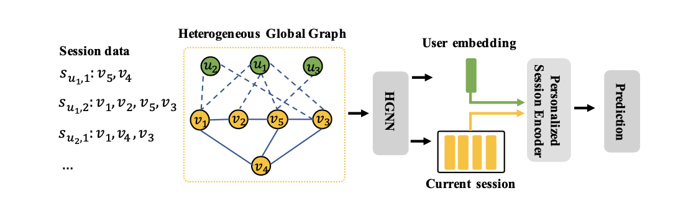
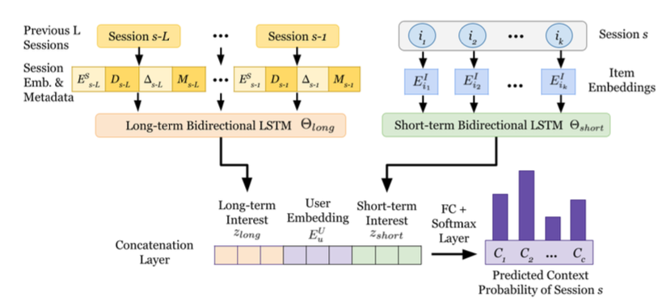
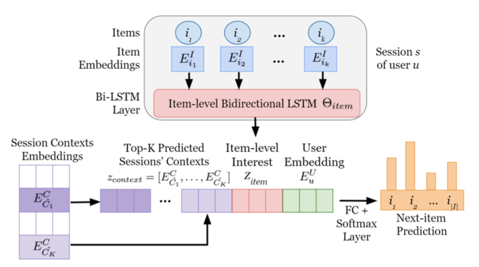
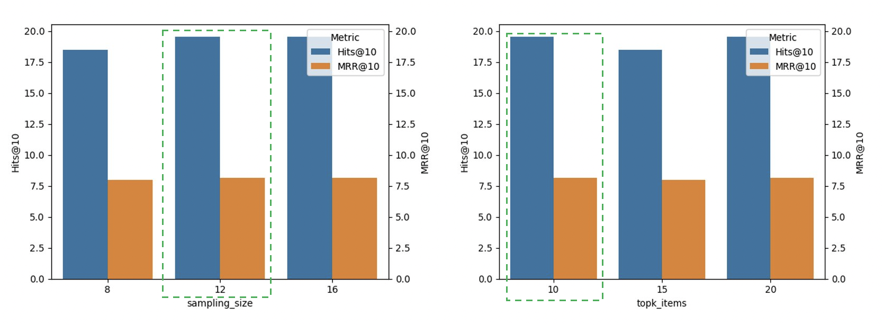
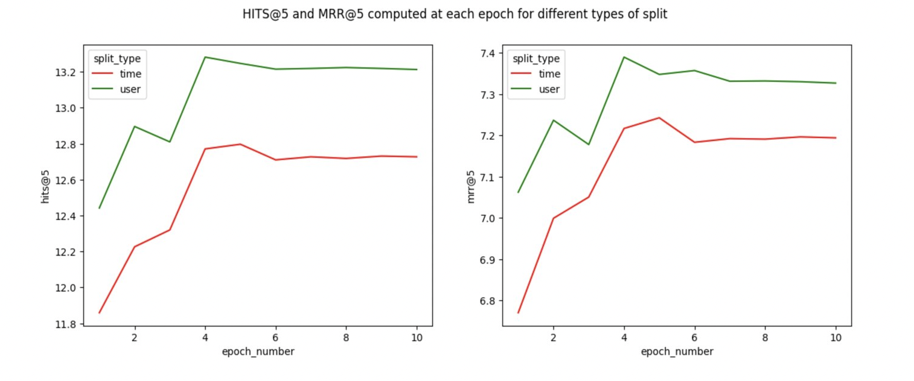
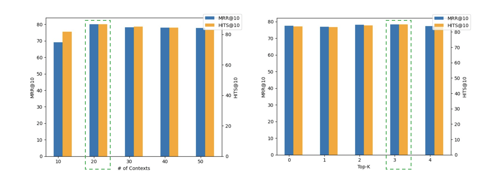
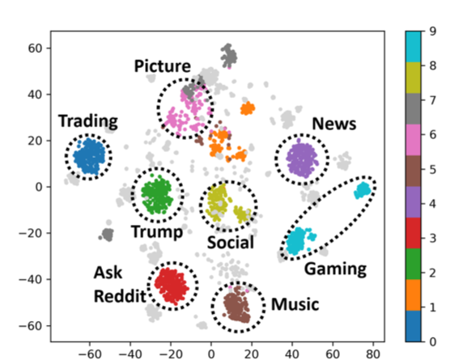

# Exploration of Personalized Session Based Recommendation 

 
 
 

  <!-- TABLE OF CONTENTS -->
<h2 id="table-of-contents"> Table of Contents</h2>

  
Table of Contents

  <ol>
    <li><a href="#Abstract"> ➤ Abstract</a></li>
    <li><a href="#Introduction"> ➤ Introduction</a></li>
    <li><a href="#Literature"> ➤ Literature Survey</a></li>
    <li><a href="#Datasets"> ➤ Datasets</a></li>
    <li><a href="#Methodology"> ➤ Methodology</a></li>
      <ul style="list-style-type:circle">
       <li> <a href= "#HGGNN">  Heterogeneous Global Graph Neural Networks </li>
        <li> <a href= "#ISCON"> Inferring Implicit Session Contexts for Next-item prediction </li>
      </ul>
    <li><a href="#experiments"> ➤ Experiments and Results</a></li>
          <ul style="list-style-type:circle">
       <li> <a href= "#settings">  Experimental Settings </li>
       <li> <a href= "#comparison"> Model Comparison </li>
       <li> <a href= "#tuning"> Hyperparameter Tuning </li>
       <li> <a href= "#ablation"> Ablation and Effectiveness Analyses </li>
      </ul>
    <li><a href="#Conclusion"> ➤ Conclusion</a></li>
    <li><a href="#Contributors"> ➤ Team Members</a></li>
    <li><a href="#References"> ➤ References</a></li>
  </ol>

<!-- Abstract -->
<h2 id="Abstract"> Abstract </h2>

*Many multi-billion dollar industries rely on innovations in recommendation space to boost up user-engagement by elevating the user experience. One such innovation is grouping interactions by ”sessions” – which are defined over a time window. The session-based architectures are designed in a way to capture both the short-term and long-term generic interests of the user and combines them to generate top-notch recommendations. However, there are some shortcomings with the existing methods which we try to address using a couple of approaches.
The existing personalized session-based recommenders are limited to sessions of the current user and are ignorant of the insightful item-transition patterns from other users’ historical sessions. Also, they neglect user historical sessions while modeling user preference, which often leads to non-personalized recommendations. To address these issues, we implemented a novel Heterogeneous Global Graph Neural Network method (HG-GNN) and a Context-aware method - Implicit Session Contexts for Next-Item Recommendations (ISCON) following <a href="#9"> [9] </a> <a href="#10"> [10] </a>.
We evaluated the results of our methods on datasets of two different domains: Reddit and LastFM. We conducted various experiments which show that the HG-GNN method performed better on the LastFM dataset whereas the ISCON method performed comparatively better on the Reddit dataset.*

<!-- Background -->
<h2 id="Introduction"> Introduction </h2>
Recommendation systems are widely used in online platforms, as
an effective tool for addressing information overload. Recently, in
some real-world applications (e.g. stream media), recommendation
systems need to focus on the interactions within the active session,
where a user’s session is defined as a sequence of its interactions
with items occurring within a short time period <a href="#11"> [11] </a>.
 
Existing session-based recommendation systems are limited to sessions of the current user and are ignorant of the insightful item-transition patterns from other users’ historical sessions. Also, they neglect user historical sessions while modeling user preference, which often leads to non-personalized recommendations. Another limitation of existing context-aware models, is that they aren't able to incorporate session context and while there are some that do, they require the session context information to be provided explicitly. 
The primary objective of our implementation is to do exploration
of these models on two separate datasets, which will allow us to
compare and contrast different methods and potentially extrapolate
the trends of performance between different models and different
datasets. We also have a secondary objective, that is to make the session-based recommendations more personalized and at the same time, outperform the current state-of-the-artwork by injecting context awareness to further strengthen our recommendations. 
 
We address these issues by implementing a novel Heterogeneous Global Graph Neural Network (HG-GNN) to exploit the item transitions over all sessions in a subtle manner for better inferring the user choices from the current and historical sessions. We have compared the performance of the above-mentioned design with another design of session-based recommendation systems - Implicit Session Contexts for Next-Item Recommendations (ISCON) which is context aware.
We explored these models on two separate datasets - Reddit and LastFM. 
The Reddit Dataset contains tuples of user names, a subreddit where the user comment to a thread, and an interaction timestamp. The LastFM Dataset contains the whole listening habits of nearly 1,000 users collected from LastFM. The objective of the Reddit dataset was to recommend relevant subreddits to the user and for LastFM, it was to recommend relevant artists to the users.
 
Through our implementation of the methods, we were able to achieve comparable results with the state-of-the-art implementation on the LastFM dataset. Moreover, the two methods had contrasting results on the two datasets, with HG-GNN model performing better on Lastfm compared to ISCON and the ISCON method outperforming on Reddit dataset. Experimentally, we also observed that our split strategy at the user interactions level with the optimal hyperparameter settings was able to give slightly improved results compared to the baseline in case of the HG-GNN framework. Additionally, we performed an ablation study to confirm the effectiveness of the two methods.
 
Our project in its final form serves as a great benchmark for the current state-of-the-art methods available in session-based recommendation systems and is built to overcome the existing problems and would help make the daunting task of recommending relevant items achievable.

<!-- Literature Survey -->
<h2 id="Literature"> Literature Survey </h2>

Next, we review the related works of session-based recommendations.
 
Context Aware Methods: 
 A session context (i.e., a user’s high-level interests or intents within a session) can imply various aspects such as temporal features <a href="#1"> [1] </a> and graph-based features. Session contexts  are not explicitly given in most datasets, and implicitly inferring session context as an aggregation of item-level attributes is crude. Context-aware recommender systems \cite{Alex01} incorporate contextual information into their models for capturing user preferences correctly <a href="#16"> [16] </a>. Many algorithms assume the context information is given <a href="#1"> [1] </a> <a href="#6"> [6] </a> <a href="#8"> [8] </a> or perform user- or interaction-level contextualization <a href="#2"> [2] </a>, not session-level. Few methods <a href="#14"> [14] </a> are able to contextualize sessions, but their contextualizations can be inaccurate for sessions with few items or sessions that are not included in the training, since they do not utilize other session information or cannot inductively contextualize sessions without model retraining. Graph neural network-based models <a href="#16"> [16] </a> <a href="#17"> [17] </a> also achieve superior performance by capturing complex transitions of items on a session-item graph. These models cannot assign implicit contexts to sessions accurately, predict session contexts, or use the session contexts for the next-item prediction.
 
GNN Based Methods: 
Recent years have seen a surge of interests in Graph Neural Networks <a href="#4"> [4] </a> <a href="#5"> [5] </a> and as a result various GNN methods have been utilized for improving recommendation system. Several GNN-based models have been proposed to learn item representations for the session-based recommendation <a href="#3"> [3] </a>. <a href="#15"> [15] </a> proposed to construct a multi-relational item graph for session-based behavior prediction. Chen et al. <a href="#3"> [3] </a> proposed a lossless encoding scheme that preserved the edge-order for better modeling of the conversion of sessions to graphs. Additionally, it proposed a shortcut graph attention layer to capture long-range dependencies between items in the session. GCE-GNN proposed a framework that adopted GNNs to learn session- level and global-level item embeddings from the directed session graph and the undirected global item graph, and integrated the different level item embeddings to generate the final session embedding. However, these methods fail to consider the historical user sessions, and mainly focus on the item sequence in the session, leading to non-personalized recommendations.
These methods only use the sessions of the current user and ignore useful item-transition patterns from other users’ historical sessions. Historical sessions of other users can provide useful item transition patterns and might help model the current user preference.

<!-- Datasets-->
<h2 id="Datasets"> Datasets </h2>
To accomplish our goals, we plan on using two different datasets – The Reddit dataset, and the Lastfm dataset. Both datasets have been used frequently in the creation of session-based recommendation systems before, and it is our intention to utilize both in order to compare the performance of our implementations across different datasets. We have also done some cleaning by creating a mapping from the username to the user id to be in a usable format. 
 
<ul style="list-style-type:circle">
<li>Last FM: The Lastfm dataset, which can be downloaded from - <a href="http://ocelma.net/MusicRecommendationDataset/lastfm-1K.html">Dataset Link</a>, contains the music listening history of around 992 users. We specifically aim to utilize the music artists as the item for providing the recommendation. We group the interaction items from the user within 8 hours as a single session following the idea in <a href="#3"> [3] </a>. </li>

<li>Reddit: The Reddit based dataset, which is readily available through <a href="https://www.kaggle.com/datasets/colemaclean/subreddit-interactions?resource=download">Dataset Link</a> contains the subreddit interaction information for nearly 20,000 users and around 35,000 unique subreddits in the form of a tuple (user, subreddit, timestamp). As part of pre-processing the data, we created the session ids by splitting the interactions on subreddits into different sessions by using a 60-minute time interval limit taking the idea from <a href="#16"> [16] </a> . We also filtered out sessions having less than 3 interactions and kept users having 5 sessions or more to have sufficient historical sessions taking the inspiration from <a href="#11"> [11] </a> <a href="#18"> [18] </a>. </li>
</ul>

Table 1: Statistics of datasets used in experiments 

| Statistic           | Last.fm | Reddit    |
|---------------------|---------|-----------|
| No. of Users        | 992     | 21,177    |
| No. of Items        | 50,000  | 22,498    |
| No. of Sessions     | 702,941 | 1,337,594 |
| Avg. Session Length | 10.71   | 1.77      |
| Sessions per User   | 708.61  | 65.05     |

<!-- Methodology -->
<h2 id="Methodology"> Methodology </h2>
We are exploring 2 different existing methods to solve the task of personalized session-based recommender systems and will be doing a comparative study across a couple of datasets:

<h3 id="HGGNN"> Heterogeneous Global Graph Neural Networks </h3>
This will be implemented in 2 stages:
<ol>
 <li><b>Graph Construction: </b> User-item historical interaction edges are utilized to construct user-item edges in the graph in order to capture user preference and the potential correlation is utilized through calculating similar item pairs based on the global co-occurrence information to construct item edges. The pairwise item transitions in the session sequence are also used to construct connections. </li>
 <li><b>Model Architecture: User and Item representations are encoded using a Heterogeneous Global Graph Neural Network (HG-GNN) on the directed heterogeneous global graph inspired by <a href="#5"> [5] </a> <a href="#12"> [12] </a>. The node representations are updated by aggregating features of neighbors and passing messages along edges. Finally, a personalized session Encoder is used to combine the general user preference and temporal interest of the current session. To capture Current preference learning, an item-level attention mechanism is applied which dynamically selects and linearly combines different item information of the current session following <a href="#3"> [3] </a> <a href="#7"> [7] </a><a href="#17"> [17] </a>. The General Preference learning is done by considering the correlation between the items in the current session and user general embedding learned from the HGNN layer.</b> </li>
</ol>

  
Figure 1: HG-GNN Architecture

 
<b> Hyperparameters:</b> The mini Batch Size used is 512. The ranges of the hyper-parameters are \{32, 64, 96, 128, 256\} for embedding size, {4, 8, 12, 16} for sampling size,  and {5, 10, ..., 30} for the number of similarity items K.  
For the GNN-based models, we search the total number of GNN layers in {1, 2, 3, 4}.  

<a href="https://github.com/0215Arthur/HG-GNN">Link to Code Repo</a>

We have used this approach because this method is quite useful for personalized session-based recommendations as it takes into account item-item, and user-item historical interactions as well as the co-occurrence of items in creating a graph. Also, in the recommendation algorithm utilizing GNN, both the current and historical session information is captured to calculate the final session representation of a user which helps capture the long-range general preference of the user as well.

<h3 id="ISCON"> Inferring Implicit Session Contexts for Next-item prediction </h3>
Context-aware recommendations <a href="#1"> [1] </a> <a href="#6"> [6] </a><a href="#8"> [8] </a> have also gained attention as contexts can represent high-quality knowledge about the user’s interests. A session’s contexts can be used as prior knowledge to predict items that the user is likely to be interested in the session, and this can enhance the next-item prediction accuracy. 
Session Contextualization is done in 2 steps:  
 <ul style="list-style-type:circle">
  <li>Generating session embeddings from a bipartite session-item multigraph using GraphSAGE <a href="#5"> [5] </a>.</li>
  <li>Clustering sessions to identify implicit session context clusters.</li>
 </ul>

  
Figure 2: ISCON - Context Prediction

Predicting the context of a future session and updating the context of the session in real-time (as new items are observed) can help guide the next-item prediction task. The session context is predicted using both long-term and short-term interest vectors obtained using Bi-Directional LSTMs <a href="#13"> [13] </a>as well as trainable user embedding.

  
Figure 3: ISCON - Next Item Prediction with Context

For each session, top-K predicted contexts with the highest probability scores are selected, and concatenated with user's item-level interest within a session and user embedding to generate next-item prediction. We expect improved personalization with user embeddings since it is trained only with interactions of that particular user and is a representation of a user’s overall behavior.

<b>Hyperparameters:</b> The number of session contexts is 40 and the number of predicted contexts per session is 3. The user and item embedding sizes are 256 and the contextual embedding size is 32 and the maximum training epoch is set to 200, a learning rate is set to 0.001, the batch size is set to 1024, and the maximum sequence length per user is set to 50.

<a href="https://github.com/claws-lab/iscon">Link to Code Repo</a>

<!-- experiments -->
<h2 id="experiments"> Experiments and Results </h2>
To answer the following research questions, we conduct experiments on session-based recommendation to evaluate the performance of our methods:
<ul style="list-style-type:circle">
 <li> RQ1: How do both the designs compare against each other on various performance metrics.</li>
 <li> RQ2: How do the hyper-parameters influence the effectiveness of the chosen designs? </li>
 <li> RQ3: How do different settings of HG-GNN and ISCON influence the performance - ablation study?</li>
</ul>

<h3 id="settings"> Experimental Settings </h3>
<!-- <ul style="list-style-type:circle">
 <li> Task: </li>
 <li> Evaluation Metrics : </li>
 <li> Train-Test Data Split : </li>
 <li> System Settings : </li>
</ul> -->

Task : Our recommendation objective is to utilize the historical sessions
$S_{u_{i, 1}}, S_{u_{i, 2}}, \ldots, S_{u_{i, t-1}}$ and
current session $S_{u_{i, t}}$ of $u_{i}$ and predict the next item
$v_{l+1}^{u_{i, t}}$ that the user is most likely to view/interact with,
where l is the current session length. Our model generates a probability
score for each item, i.e., 
$\hat{y}$ = $\hat{y_{1}}, \hat{y_{2}}. \ldots, \hat{y_{|V|}}$
where $\hat{y_{i}}$ denotes the prediction score of item $v_{i}$.
Additionally, we explore a context-aware method that contextualizes the
sessions to capture the user's general interest and leverage it to
improve our next-item prediction task.

### Evaluation Metrics :

To evaluate the recommendation performance, we use 2 widely used
metrics: Hit Ratio (HR@k) and Mean Reciprocal Rank (MRR@k) for k= 5,10
following <a href="#16"> [16] </a><a href="#17"> [17] </a>. These metrics are primarily used for
evaluating whether the next predicted item is relevant or not and
whether relevant documents are ranked higher. The Hit ratio is simply
the fraction of users for which the correct answer is included in the
recommendation list of length k = 5,10 whereas ‍Mean Reciprocal Rank
quantifies the rank of the first relevant item found in the
recommendation list averaged across all users.

### Train-Test Data Split :

We use the 80-20 split ratio on user-specific sessions for creating
training and test sets for each user. We take the last 20% sessions as
the test set and the remaining as the training set. To avoid
complications, we filter out sessions from the test set where the items
do not appear in the training set. We are using 2 cross-validation
approaches:

1.  By Time - We split the entire dataset in the above-specified ratio
    by time. The split by time happens in a way such that data is split
    on a globally selected time such that the total number of
    interactions are divided in 80-20 split.

2.  By Interactions - We will split the data set for each user in the
    above-specified ratio by interactions. The split by interactions
    happen in a way such that 80% of the interaction of a user are in
    training and the remaining 20% are in test.

We will be comparing the results for both splits across both designs on
various metrics. This will help us realize the benefits and limitations
of each method. This will also help us answer, which split is better for
our use case - which is - session-based recommendations.

### System Settings : 

We are using premium GPUs on Google Colab (NVIDIA V100/A100 Tensor
Core GPUs. Additionally, we also utilized the COC-ICE-GPU cluster on
PACE to run some of our experiments on Tesla V100 GPUs.

<h3 id="comparison"> Model Comparison - RQ1 </h3>

To demonstrate the overall model performance, we obtained important observations and compared the results shown in Table 2. Overall, the performance of each model was drastically different between each dataset, with the ISCON model performing better on the Reddit dataset, and the HG-GNN model performing better on the LastFM dataset.  
HG-GNN model outperforms the ISCON model when it comes to LastFM dataset. In terms of both Hits Ratio@5 and MRR@5 , HG-GNN outperforms ISCON by around 41% and 42% respectively.
This could be due to the fact that LastFM dataset has a significant number of items per session which can make specific context generation difficult. As ISCON model relies on generating session context and using that to predict context for current session, having longer sessions can make the task of predicting context difficult. Thus, the ISCON model performs poorer on this data. Another hypothesis for better performance of HG-GNN is the superior architecture in terms of determining co-occurring items using the global graph which helps in getting more information out of longer sessions.  
Comparing the two models on Reddit data set, ISCON was able to outperform HG-GNN model. In terms of both Hits Ratio@5 and MRR@5 , ISCON outperforms HG-GNN model on the subset of Reddit data with ISCON model achieving a Hits ratio above 0.8 and MRR above 0.7 which was considerably high when compared to the HG-GNN model. 
Since the Reddit dataset has few average items per session, it can be difficult to generate item – item co-occurrence for an HG-GNN model, leading to poorer performance. Also the reddit data set has more number of sessions as compared to the LastFM dataset, which helps ISCON better contextualize sessions and learn long-term user preference that ultimately helps predict the next-item in the current session.

 

Table 2: Experimental results (%) of different models in terms of HR@5, 10, and MRR@5, 10 on the two datasets 

| Model  |       |        | Last.fm |        |       | Reddit |        |        |
|--------|-------|--------|---------|--------|-------|--------|--------|--------|
|        | HR@5  | HR@10  | MRR@5   | MRR@10 | HR@5  | HR@10  | MRR@5  | MRR@10 |
| HG-GNN | 13.25 | 19.54  | 7.34    | 8.17   | 27.3  | 43.7   | 15.85  | 18.35  |
| ISCON  | 9.37  | 14.40  | 5.18    | 5.83   | 81.47 | 85.72  | 71.12  | 71.70  |

<h3 id="tuning"> Hyperparameter Tuning - RQ2 </h3>
 HG-GNN: In this subsection, we perform experiments to explore how hyper-parameters like sampling size S and top-K similar items $Top K$ influence the model performance. These hyperparameters were key to building the global graph based on which user and item embeddings were learned leveraging the Heterogeneous Global Graph Neural Networks.
 <ul style="list-style-type:circle">
  <li>Effect of sampling size : In the process of building the global graph, due to calculation efficiency and information validity, we sample S edges for each item node according to the weight of the adjacent edges $r_{in}$ or $r_{out}$. Thus, S is the pivotal hyperparameter for our model.</li>
  <li>Effect of the Top-K similar items : The number of similar items is another key hyper-parameter for the global graph. For each item, we select the top-K similar items based on the global co-occurrence information to construct the similar edges $r_{similar}$.</li>
  <li>Effect of the data split strategy: As seen from figure 5, it is pretty evident that better results are obtained when we are splitting the dataset based on user interactions as compared to the split based on time.</li>
 </ul>
 

  
Figure 4: Impact of sampling size and Top-k similar items on Model Performance

  
Figure 5: Impact of how we split the data ?

ISCON : For our ISCON model, we perform similar experiments to explore how hyper-parameters such as number of contexts $C$ and top-k predicted contexts $K$ influence the model performance.  
For the process of finding the optimal number of implicit context $C$ for ISCON, we employed an iterative method to look through a range of integers until we found an optimum. During the process, we found that although there is little to no change in the evaluation metrics for next-item prediction, we saw noticeable difference in the evaluation metrics for context-prediction. We think that this can be attributes to larger clusters formation during K-Means which helps in grouping similar sessions with the same implicit context. Thus we were able to achieve an optimal value of $C=30$. A similar iterative process was employed for finding the top-k predicted contexts to use for next-item prediction. Throughout the process, little to no change was observed in the evaluation metrics for context and next-item prediction. For our use case we were able to find $K=3$ to be an optimal value as 3 contexts instead of only one context increases the breadth of predictions and prevents erroneous predictions due to wrong context predictions.

  
Figure 6: Impact of total number of contexts and top K contexts on Model Performance

<h3 id="ablation"> Ablation and Effectiveness Analyses - RQ3 </h3>
In this subsection, we conduct some ablation studies on the chosen models to investigate the effectiveness of some designs.
 <ul style="list-style-type:circle">
  <li>HGGNN :  
   Impact of Critical Components : Here , we do a surgical analysis to understand the impact of General Preference Learning (GPL) and Current Preference Learning (CPL) on the overall model performance with the set of hyperparameters yielding best results. GPL method helps us capture the long-term interest of the user and is learned through the Graph neural network whereas CPL method leverages a session encoder with an attention mechanism to model the current interest of the user. Thus, based on the results of the ablation study (as shown in Table 3), we could say that the CPL model is quite critical to the model's performance as the performance takes quite a dip in its absence. The GPL model appears to be not that significant though. </li>
 </ul>

Table 3: Impact of different layers of HG-GNN on LastFM 

| Model Setting  | HR@5  | HR@10 | MRR@5 | MRR@10 |
|----------------|-------|-------|-------|--------|
| w/o CPL Module | 12.64 | 18.92 | 7.01  | 7.83   |
| w/o GPL Module | 13.23 | 19.56 | 7.34  | 8.17   |
| HG-GNN         | 13.25 | 19.54 | 7.34  | 8.17   |

 <ul style="list-style-type:circle">
<li>ISCON:  
Session Context Evaluation:  Here, we verify the correctness of the derived session contexts. Since there is no ground-truth session context information available, we conduct a manual verification. We first choose the top-10 clusters by size. For each cluster, we select the 100 sessions closest to the cluster center in the embedding space. After that, we analyze the items (posts) in the sessions of each cluster and manually verify if the sessions are semantically similar. If they are, we assign a context to the cluster. Figure 4 shows a visualization of session contexts found on the Reddit dataset, where each data point is a session, and its color represents its cluster. As shown in the figure, we find distinct contexts of session clusters like Trading, Music, and News topics.</li>
</ul>

  
Figure 7: ISCON - Next Item Prediction with Context

<!-- Conclusion -->
<h2 id="Conclusion"> Conclusion </h2>
We approached the problem of personalized session-based recommendation systems using two methods - HG-GNN and ISCON. Although the 2 models performed decently well when compared to the state-of-the-art results, but there were a few shortcomings that we look to address in our future work.
Firstly, the implemented models suffered from computational constraints and it was not possible to run them for the entire Reddit dataset using the coc-ice-gpu cluster. The reason being that the codebases were not designed for multi-GPU support. Secondly, the two methods performed differently on the two datasets of different domains with the ISCON model performing well on the Reddit dataset whereas the HG-GNN method performing well on the LastFM dataset. This highlights the importance of designing models that are domain adaptive and have inductive capability.
 
Owing to the above limitations, our target would be to augment our codebase for multi-GPU support that would lend us scalability. Our future scope would also be to explore different architectures that are domain adaptive and would help us enhance robustness.

<!-- Contributors -->
<h2 id="Contributors"> Contributors </h2>
Abhinav Arun (aarun60@gatech.edu) - Georgia Institute of Technology, Atlanta, USA  
Anshit Verma (averma373@gatech.edu) - Georgia Institute of Technology, Atlanta, USA  
Mehul Soni (mehul.soni918@gatech.edu) - Georgia Institute of Technology, Atlanta, USA  
Joseph Geibig (jgeibig3@gatech.edu) - Georgia Institute of Technology, Atlanta, USA  

<!-- References -->
<h2 id="References"> References </h2>

<a id="1"> [1] </a>
Alex Beutel, Paul Covington, Sagar Jain, Can Xu, Jia Li, Vince Gatto, and Ed H.
Chi. 2018. Latent Cross: Making Use of Context in Recurrent Recommender
Systems. In *WSDM 2018: The Eleventh ACM International Conference on Web
Search and Data Mining.* 
<a id="2"> [2] </a>
Yukuo Cen, Jianwei Zhang, Xu Zou, Chang Zhou, Hongxia Yang, and Jie
Tang. 2020. Controllable Multi-Interest Framework for Recommendation.
arXiv:2005.09347 [cs.IR] 
<a id="3"> [3] </a>
Tianwen Chen and Raymond Chi-Wing Wong. 2020. Handling information loss
of graph neural networks for session-based recommendation. Proceedings of the
26th ACM SIGKDD International Conference on Knowledge Discovery amp; Data
Mining (2020). https://doi.org/10.1145/3394486.3403170 
<a id="4"> [4] </a>
Yu Chen, Lingfei Wu, and Mohammed Zaki. 2020. Iterative Deep Graph
Learning for Graph Neural Networks: Better and Robust Node Embeddings.
In Advances in Neural Information Processing Systems, H. Larochelle, M. Ran-
zato, R. Hadsell, M.F. Balcan, and H. Lin (Eds.), Vol. 33. Curran Associates,
Inc., 19314–19326. https://proceedings.neurips.cc/paper_files/paper/2020/file/
e05c7ba4e087beea9410929698dc41a6-Paper.pdf 
<a id="5"> [5] </a>
William L. Hamilton, Rex Ying, and Jure Leskovec. 2018. Inductive Representation
Learning on Large Graphs. arXiv:1706.02216 [cs.SI] 
<a id="6"> [6] </a>
Casper Hansen, Christian Hansen, Lucas Maystre, Rishabh Mehrotra, Brian
Brost, Federico Tomasi, and Mounia Lalmas. 2020. Contextual and Sequential
User Embeddings for Large-Scale Music Recommendation. In Proceedings of the
14th ACM Conference on Recommender Systems (Virtual Event, Brazil) (RecSys
’20). Association for Computing Machinery, New York, NY, USA, 53–62. https:
//doi.org/10.1145/3383313.3412248 
<a id="7"> [7] </a>
Jing Li, Pengjie Ren, Zhumin Chen, Zhaochun Ren, Tao Lian, and Jun Ma. 2017.
Neural attentive session-based recommendation. Proceedings of the 2017 ACM on
Conference on Information and Knowledge Management (2017). https://doi.org/
10.1145/3132847.3132926 
<a id="8"> [8] </a>
Gabriel De Souza P. Moreira, Dietmar Jannach, and Adilson Marques Da Cunha.
2019. Contextual Hybrid Session-Based News Recommendation With Recurrent
Neural Networks. IEEE Access 7 (2019), 169185–169203. https://doi.org/10.1109/
access.2019.2954957  
<a id="9"> [9] </a>
Sejoon Oh, Ankur Bhardwaj, Jongseok Han, Sungchul Kim, Ryan A. Rossi, and
Srijan Kumar. 2022. Implicit Session Contexts for Next-Item Recommendations.
In Proceedings of the 31st ACM International Conference on Information &amp
Knowledge Management. ACM. https://doi.org/10.1145/3511808.3557613 
<a id="10"> [10] </a>
Yitong Pang, Lingfei Wu, Qi Shen, Yiming Zhang, Zhihua Wei, Fangli Xu, Ethan
Chang, Bo Long, and Jian Pei. 2022. Heterogeneous Global Graph Neural Net-
works for Personalized Session-based Recommendation. In Proceedings of the
Fifteenth ACM International Conference on Web Search and Data Mining. ACM.
https://doi.org/10.1145/3488560.3498505 
<a id="11"> [11] </a>
Massimo Quadrana, Alexandros Karatzoglou, Balázs Hidasi, and Paolo Cremonesi.
2017. Personalizing Session-Based Recommendations with Hierarchical Recur-
rent Neural Networks. In Proceedings of the Eleventh ACM Conference on Recom-
mender Systems (Como, Italy) (RecSys ’17). Association for Computing Machinery,
New York, NY, USA, 130–137. https://doi.org/10.1145/3109859.3109896 
<a id="12"> [12] </a>
Michael Schlichtkrull, Thomas N. Kipf, Peter Bloem, Rianne van den Berg, Ivan
Titov, and Max Welling. 2017. Modeling Relational Data with Graph Convolu-
tional Networks. 
<a id="13"> [13] </a>
M. Schuster and K.K. Paliwal. 1997. Bidirectional recurrent neural networks.
IEEE Transactions on Signal Processing 45, 11 (1997), 2673–2681. https://doi.org/
10.1109/78.650093 
<a id="14"> [14] </a>
Meirui Wang, Pengjie Ren, Lei Mei, Zhumin Chen, Jun Ma, and Maarten de
Rijke. 2019. A Collaborative Session-Based Recommendation Approach with
Parallel Memory Modules. In Proceedings of the 42nd International ACM SIGIR
Conference on Research and Development in Information Retrieval (Paris, France)
(SIGIR’19). Association for Computing Machinery, New York, NY, USA, 345–354.
https://doi.org/10.1145/3331184.3331210  
<a id="15"> [15] </a>
Wen Wang, Wei Zhang, Shukai Liu, Qi Liu, Bo Zhang, Leyu Lin, and Hongyuan
Zha. 2021. Beyond Clicks: Modeling Multi-Relational Item Graph for Session-
Based Target Behavior Prediction. arXiv:2002.07993 [cs.IR] 
<a id="16"> [16] </a>
Ziyang Wang, Wei Wei, Gao Cong, Xiao-Li Li, Xian-Ling Mao, and Minghui
Qiu. 2020. Global Context Enhanced Graph Neural Networks for Session-based
Recommendation. In Proceedings of the 43rd International ACM SIGIR Conference
on Research and Development in Information Retrieval. ACM. https://doi.org/10.
1145/3397271.3401142 
<a id="17"> [17] </a>
Shu Wu, Yuyuan Tang, Yanqiao Zhu, Liang Wang, Xing Xie, and Tieniu Tan. 2019.
Session-Based Recommendation with Graph Neural Networks. Proceedings of
the AAAI Conference on Artificial Intelligence 33, 01 (jul 2019), 346–353. https:
//doi.org/10.1609/aaai.v33i01.3301346 
<a id="18"> [18] </a>
Mengqi Zhang, Shu Wu, Meng Gao, Xin Jiang, Ke Xu, and Liang Wang. 2022.
Personalized Graph Neural Networks With Attention Mechanism for Session-
Aware Recommendation. IEEE Transactions on Knowledge and Data Engineering
34, 8 (aug 2022), 3946–3957. https://doi.org/10.1109/tkde.2020.3031329 

